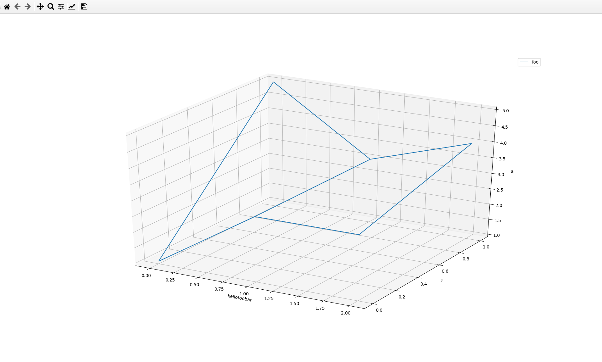

# matrix-vis

This program visualizes multidimensional NumPy matrices in the following
way:

One (for 2D output) or two (for 3D output) dimensions are chosen as the input
axes for the output plot. In the example config (in `visualize.py`), the third
to last dimension is set as the x axis, the penultimate dimension is set as
the y axis (and the last dimension is set as data series list, see the
sequel), see the lines

```
config[-3] = 'x'
config[-2] = 'y'
```

One dimension is chosen as the list of data series. The data series can be
filtered and scaled (see the configuration line of code `config[-1] = [(0, 1)]`:
the first data series is displayed scaled with the ratio of 1, i.e. no scaling).

From the rest of dimensions, constant indexes of the displayed rows are chosen.
In our example config, the indexes are set to zeroes:

`config = [0 for _ in dimensions]`

This configuration is for now fixed in the code (see the `config` variable), but
soon it will be modifiable via Qt GUI. If you want 2D graph, do not set the 'y'
dimension.

The input data format is shown in the comprehensive `create_example_data.py`

**Note:** The row labels in the data file (dimension definition) are used only
in the Qt GUI and in the legend. The input axes in the plot are labelled with
numbers 0, 1, ...

## Run the example:

Python 3.7.4 was used for the development. Install the requirements (ideally in
a virtual environment):

`pip install -r requirements.txt`

Then run `python3 create_example_data.py | python3 visualize.py`


